## Default Tiles
<table>
    <thead>
        <th>Tiles</th>
    </thead>
    <tr>
        <td> Ceramic Tile</td>
        <td>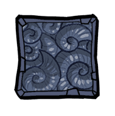 Fossil Tile</td>
        <td>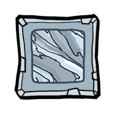 Granite Tile</td>
        <td> Graphite Tile</td>
    </tr>
    <tr>
        <td>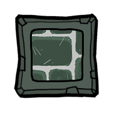 Igneous Rock Tile</td>
        <td>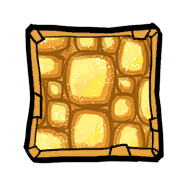 Isoresin Tile</td>
        <td> Mafic Rock Tile</td>
        <td> Obsidian Tile</td>
    </tr>
    <tr>
        <td>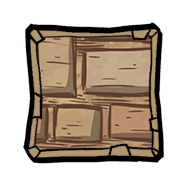 Sandstone Tile</td>
        <td> Sedimentary Rock Tile</td>
        <td> Insulation Tile</td>
        <td> Ceramic Carpet Tile</td>
    </tr>
    <tr>
        <td> Fossil Carpet Tile</td>
        <td> Granite Carpet Tile</td>
        <td> Graphite Carpet Tile</td>
        <td> Igneous Rock Carpet Tile</td>
    </tr>
    <tr>
        <td>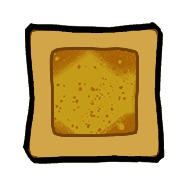 Isoresin Carpet Tile</td>
        <td>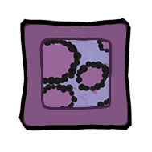 Mafic Rock Carpet Tile</td>
        <td> Obsidian Carpet Tile</td>
        <td>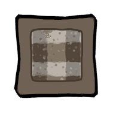 Sedimentary Rock Carpet Tile</td>
    </tr>
    <tr>
        <td> Insulation Carpet Tile</td>
        <td>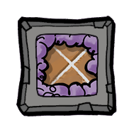 Ceramic Insulation Tile</td>
        <td>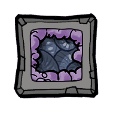 Fossil Insulation Tile</td>
        <td>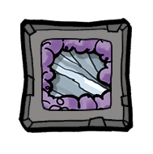 Granite Insulation Tile</td>
    </tr>
    <tr>
        <td> Graphite Insulation Tile</td>
        <td>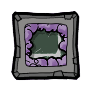 Igneous Rock Insulation Tile</td>
        <td> Isoresin Insulation Tile</td>
        <td>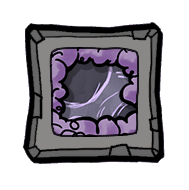 Mafic Rock Insulation Tile</td>
    </tr>
    <tr>
        <td>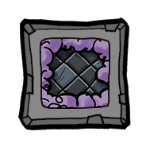 Obsidian Insulation Tile</td>
        <td> Sandstone Insulation Tile</td>
        <td>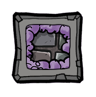 Sedimentary Rock Insulation Tile</td>
        <td> Insulation Insulation Tile</td>
    </tr>
    <tr>
        <td> Aluminum Ore Mesh Tile</td>
        <td>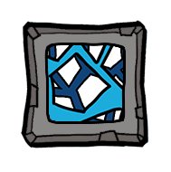 Cobalt Ore Mesh Tile</td>
        <td> Copper Ore Mesh Tile</td>
        <td> Electrum Mesh Tile</td>
    </tr>
    <tr>
        <td> Gold Amalgam Mesh Tile</td>
        <td> Iron Ore Mesh Tile</td>
        <td>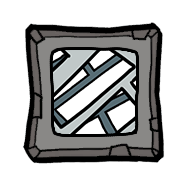 Niobium Mesh Tile</td>
        <td> Steel Mesh Tile</td>
    </tr>
    <tr>
        <td>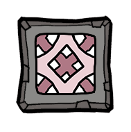 Thermium Mesh Tile</td>
        <td> Uranium Ore Mesh Tile</td>
        <td> Wolframite Mesh Tile</td>
        <td> Aluminum Mesh Tile</td>
    </tr>
    <tr>
        <td> Cobalt Mesh Tile</td>
        <td> Copper Mesh Tile</td>
        <td> Gold Mesh Tile</td>
        <td> Pyrite Mesh Tile</td>
    </tr>
    <tr>
        <td> Iron Mesh Tile</td>
        <td> Lead Mesh Tile</td>
        <td> Depleted Uranium Mesh Tile</td>
        <td> Enriched Uranium Mesh Tile</td>
    </tr>
    <tr>
        <td> Tungsten Mesh Tile</td>
        <td> Aluminum Ore Airflow Tile</td>
        <td> Cobalt Ore Airflow Tile</td>
        <td> Copper Ore Airflow Tile</td>
    </tr>
    <tr>
        <td> Electrum Airflow Tile</td>
        <td> Gold Amalgam Airflow Tile</td>
        <td>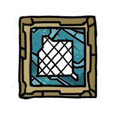 Iron Ore Airflow Tile</td>
        <td>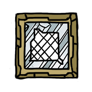 Niobium Airflow Tile</td>
    </tr>
    <tr>
        <td> Steel Airflow Tile</td>
        <td>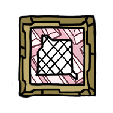 Thermium Airflow Tile</td>
        <td> Uranium Ore Airflow Tile</td>
        <td> Wolframite Airflow Tile</td>
    </tr>
    <tr>
        <td> Aluminum Airflow Tile</td>
        <td> Cobalt Airflow Tile</td>
        <td> Copper Airflow Tile</td>
        <td> Gold Airflow Tile</td>
    </tr>
    <tr>
        <td> Pyrite Airflow Tile</td>
        <td> Iron Airflow Tile</td>
        <td>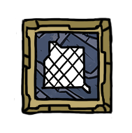 Lead Airflow Tile</td>
        <td> Depleted Uranium Airflow Tile</td>
    </tr>
    <tr>
        <td> Enriched Uranium Airflow Tile</td>
        <td> Tungsten Airflow Tile</td>
        <td> Aluminum Metal Tile</td>
        <td> Cobalt Metal Tile</td>
    </tr>
    <tr>
        <td> Copper Metal Tile</td>
        <td> Depleted Uranium Metal Tile</td>
        <td> Gold Metal Tile</td>
        <td> Iron Metal Tile</td>
    </tr>
    <tr>
        <td>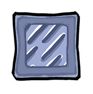 Lead Metal Tile</td>
        <td>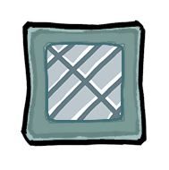 Niobium Metal Tile</td>
        <td> Steel Metal Tile</td>
        <td> Thermium Metal Tile</td>
    </tr>
    <tr>
        <td> Tungsten Metal Tile</td>
        <td> Diamond Glass Tile</td>
        <td></td>
        <td></td>
    </tr>
</table>